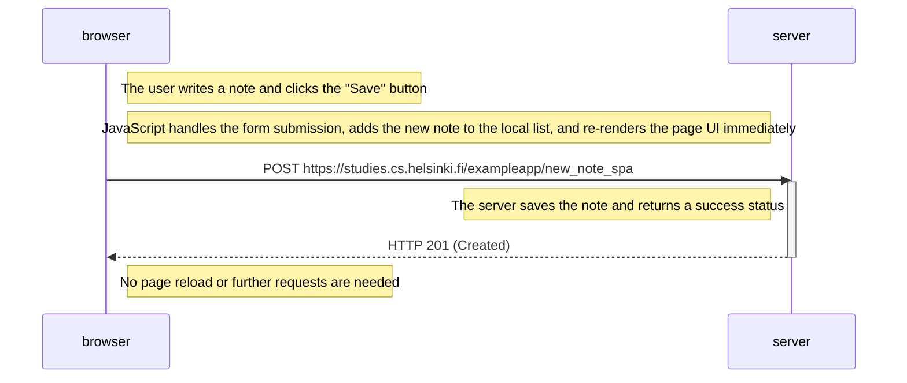

```mermaid
sequenceDiagram
    participant browser
    participant server

    Note right of browser: The user writes a note and clicks the "Save" button
    
    Note right of browser: JavaScript handles the form submission, adds the new note to the local list, and re-renders the page UI immediately

    browser->>server: POST https://studies.cs.helsinki.fi/exampleapp/new_note_spa
    activate server
    Note left of server: The server saves the note and returns a success status
    server-->>browser: HTTP 201 (Created)
    deactivate server

    Note right of browser: No page reload or further requests are needed
```